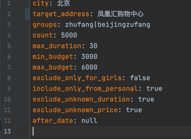

# 全网可能最智能的豆瓣小组租房筛选系统

## init

### environment variables

为安全考虑，以下变量需要需写入环境变量，再经由程序读取。

1. `GAODE_KEY`: 高德key
2. `DOUBAN_COOKIE`: 豆瓣已登录后的网页cookie

### python environment

```shell
# a python virtualenv is strongly suggested or directly install the requirements
pip install -r requirements.txt
```

## usage sample

### test if project does work

```shell
# `-c` means `city`, for gaode api to recognize your search area
# `-a` means `address`, normally it's your company address, which maybe a building
# `-g` means `groups`, which are joined id list of douban groups by separator `|`
# `-o` means `output_format`, use `-o CSV` for write into csv and for later analysis
# `-n` means `count`, it means how many items you wanna scrape for each group, 5000 is a suitable amount
python src/main.py -c 北京 -a 凤凰汇购物中心 -g "zhufang|beijingzufang" -o CSV -n 50
```

### another way to run via configuring the `src/config.yaml`



Then running just via: 

```shell
python src/main.py
```